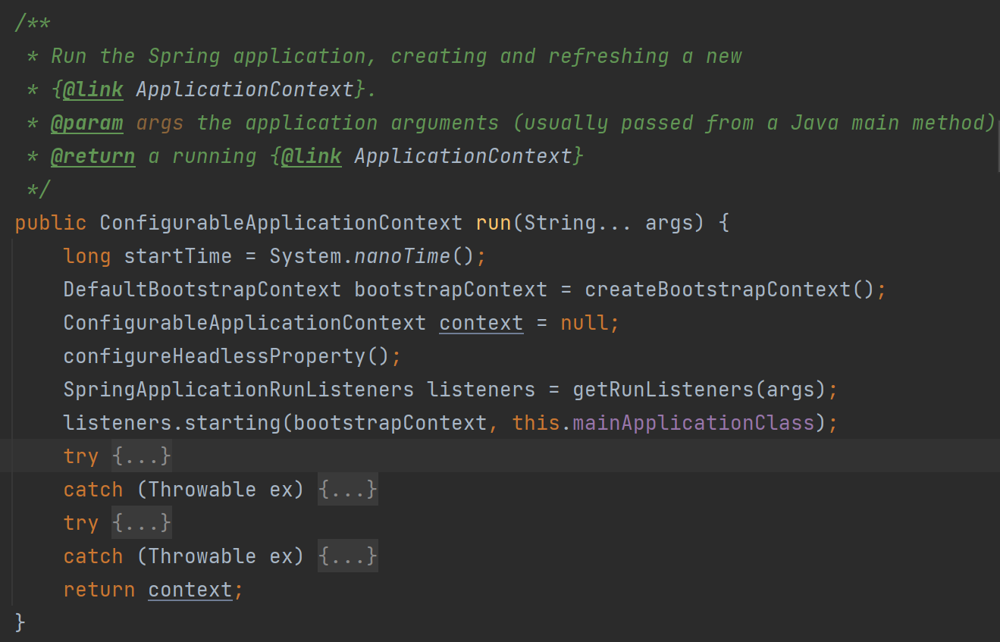
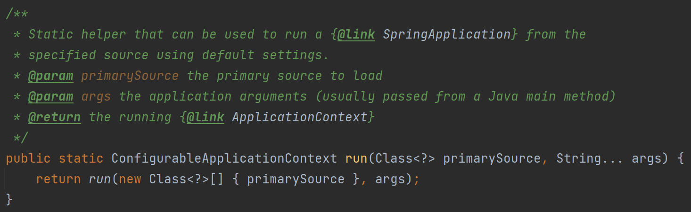
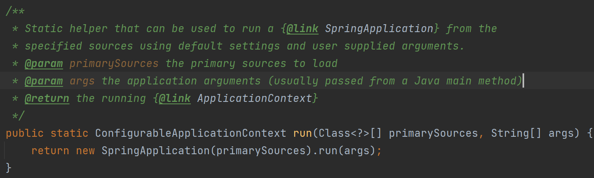
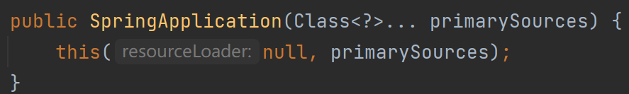
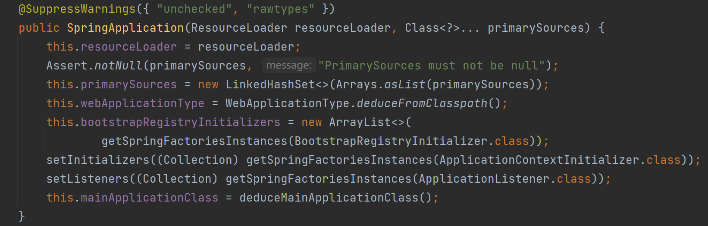

# 1. 新建工程

略

# 2.找到启动类

1. 找到使用了`@SpringBootApplicaiton`的类

2. 找到`main`方法，这里调用了`SpringApplicaiton.run `，该方法是用来启动Spring应用程序的。

3. `SpringApplicaiton.run`方法接收两个参数：

   1. 第一个参数是一个指向Spring Boot应用程序入口类的引用（这个例子中是`SpringToSpringBootApplication.class`）

   2. 第二个参数`args`是传递给应用程序的命令行参数。

      这个`args`参数是一个字符串数组（`String[] args`），它会接收任何命令行上传递给应用程序的参数。当你在终端或命令提示符中启动Spring Boot应用程序时，你可以在命令后面附加参数，这些参数会被Spring框架收集并传递给`SpringApplication.run`方法。在应用程序中，你可以通过Spring的`Environment`接口或`@Value`注解来访问这些参数。这使得你能够根据不同的环境或配置来动态地调整应用程序的行为。

4. ctrl+鼠标左键打开run方法，一共可以看到三个run方法：

   ①

   

   ②

   

   ③

   

   

   **说明1：关于②和③两个静态方法**

   后两个为静态方法，由于@SpringBootApplication文件中是直接的类名.run调用的，所以调用的是后两个静态方法，这两个方法是为了提供不同的启动选项，允许在没有创建`SpringApplication`实例的情况下启动Spring应用程序：

   ②接受两个参数：一个是单个的`Class<?>`对象，另一个是一个可变参数`String... args`，这表示`args`可以是任何数量的字符串。

   ③接受一个`Class<?>[]`数组作为第一个参数，这意味着你可以传递一个类数组，允许指定多个配置类。第二个参数是一个字符串数组`String[] args`，和第一个方法中的可变参数`args`相似，但这里是作为一个完整的数组传入的。

   当你只有一个主启动类时，你可以使用②，它允许你传递一个单一的类，这通常是你的主Spring Boot应用程序类。

   如果你的应用程序需要从多个配置类启动，你可以使用③，传入一个类的数组。

   **说明2：关于②的return**

   ②的return是调用的③，复用③的逻辑，不必编写额外的代码

   **说明3：关于③的return**

   ③的return将先实例化一个SpringApplication类，再调用它的run方法。

   所以接下来我们先看实例化的方法，完了以后再看第一个run

# 3. 构造函数

这个阶段的目的是准备和配置Spring Boot应用的基础设施和环境。这包括加载和配置必要的组件，注册初始化器和监听器，以及确定应用类型等。它为接下来的ApplicationContext创建和刷新提供了必要的预配置。

→就是加载基础资源

找到两个构造函数：

① 接受一个或多个主要源（Spring配置类）作为参数，并调用第二个构造函数

this通常指当前对象，this()是调用重载的另一个构造函数的意思。

②

接下来，详细看一下②构造函数的内容！！

1. `@SuppressWarnings({ "unchecked", "rawtypes" })`

   这个注解告诉Java编译器忽略特定的警告信息，在这个例子中，忽略未经检查的类型转换警告（`unchecked`）和使用原始类型（`rawtypes`）。当你使用泛型的时候，可能会遇到这些警告。

2. `this.resourceLoader = resourceLoader;`

   加载资源（如类路径资源）

3. `Assert.notNull(primarySources, "PrimarySources must not be null");`

   使用Spring框架断言确保`primarySources`不为空，如果为空，将抛出异常。

4. `this.primarySources = new LinkedHashSet<>(Arrays.asList(primarySources));`

   存储主方法类

5. `this.webApplicationType = WebApplicationType.deduceFromClasspath();`

   确定web服务的类型：Servlet（默认，如Tomcat、Jetty）、Reactive（如spring-webflux）、None

6. `this.bootstrapRegistryInitializers = new ArrayList<>(getSpringFactoriesInstances(BootstrapRegistryInitializer.class));`

   **注册初始化：注册低级别的回调和组件**

   允许开发者向Spring Boot注册特定的回调函数和组件。“组件”在这里指的是在应用启动阶段可能需要的任何对象或功能，比如特定的配置器、处理器或其他启动时需要的基础设施。

   存储通过`SpringFactoriesLoader`加载的`BootstrapRegistryInitializer`实例，这些实例用于在应用上下文刷新之前初始化特定的注册表或执行特定的启动逻辑。

7. `setInitializers((Collection) getSpringFactoriesInstances(ApplicationContextInitializer.class));`

   **上下文初始化：注册自定义的属性源、激活配置文件或修改Bean定义**

   用于在Spring ApplicationContext创建但在刷新之前进行配置。可以通过实现`ApplicationContextInitializer`接口来对Spring上下文进行额外的配置。例如：

   - **注册自定义的属性源**：向Spring环境添加额外的属性源，这些属性源可以是配置文件、环境变量或是程序中定义的属性集。
   - **激活配置文件**：根据不同的环境（开发、测试、生产）激活特定的配置文件。
   - **修改Bean定义**：在Bean实例化之前修改其定义，比如改变Bean的作用域、添加依赖等。这里的“Bean”指的是Spring管理的对象，可以是第三方的库，**也可以是应用中定义的组件**。

   调用`setInitializers`方法设置应用上下文初始化器，这些初始化器是通过`SpringFactoriesLoader`加载的`ApplicationContextInitializer`实例的集合。它们可以用来在Spring应用上下文刷新前做一些自定义的初始化工作。

8.  `setListeners((Collection) getSpringFactoriesInstances(ApplicationListener.class));`

   **监听器**：用于监听和响应Spring应用中的各种事件。这些监听器可以在应用生命周期的不同阶段执行自定义逻辑，如应用启动、关闭等

   调用`setListeners`方法设置应用事件监听器，这些监听器是通过`SpringFactoriesLoader`加载的`ApplicationListener`实例的集合。它们用于在应用程序运行过程中监听和响应特定的事件。

   **监听**：监听是指在Spring应用中监听和响应特定的事件。Spring框架提供了一个事件发布和监听机制，允许Bean在关键生命周期事件发生时执行某些动作。例如，当应用启动、停止或者上下文刷新时，可以通过实现`ApplicationListener`接口来捕获这些事件，并执行自定义逻辑。

9. `this.mainApplicationClass = deduceMainApplicationClass();`

   找到`public static void main(String[] args)`方法的声明类。

   用来判断应用的起点，通常是带有`@SpringBootApplication`注解的类

# 4.run函数

（还没写）

# 5.补充：

- **IoC容器**：控制反转（IoC）容器是一种特殊的工厂，它在运行时自动创建和管理对象及其依赖关系。它使用DI（依赖注入）来管理组成应用程序的对象。控制反转意味着对象不再自己控制依赖对象的创建和绑定，而是由容器负责。
- **BeanFactory**：用于创建对象（或bean），而不是传统的直接使用`new`关键字来实例化对象。是Spring中最简单的容器，提供基本的DI支持。它主要用于加载和管理bean的定义，然后根据需要创建bean。
- **ApplicationContext**：是`BeanFactory`的子接口，提供了更完整的框架功能，如事件发布、国际化支持等。`ApplicationContext`是更常用的IoC容器，因为它提供了更多的企业级支持。

BeanFactory工作原理：

- **定义Bean**：在Spring的配置文件或者注解中定义bean，包括类的名称、属性等信息。
- **创建Bean**：当应用运行时，Spring IoC容器会根据这些定义创建对象实例。
- **依赖注入**：容器会自动注入对象所需的依赖，这些依赖也是通过容器管理的bean。
- **使用Bean**：应用程序从容器中获取管理的bean，而不是直接通过`new`关键字创建对象。

### BeanFactory

- **基础IoC容器**：`BeanFactory`是Spring框架中最基础的IoC容器，提供了最基本的依赖注入支持。
- **延迟加载**：`BeanFactory`在默认情况下会延迟加载Bean，即只有在请求时才创建Bean。这意味着，直到你调用`getBean()`方法，相应的Bean才会被实例化。

### ApplicationContext

- **高级IoC容器**：`ApplicationContext`是`BeanFactory`的一个子接口，提供了更为全面和高级的IoC服务。它是专为企业应用开发而设计，拥有更多的特性，如事件发布、国际化支持、注解支持等。
- **立即加载**：与`BeanFactory`不同，`ApplicationContext`会在启动时立即创建并初始化所有的单例Bean。这意味着一旦`ApplicationContext`被初始化，所有的Bean都已准备好被使用，减少了获取Bean时的延迟。
- **更多特性**：`ApplicationContext`提供了一系列高级特性，包括但不限于：
  - **消息资源处理**（国际化）
  - **事件发布**
  - **应用层面的上下文**（例如Web应用中的WebApplicationContext）
  - **注解支持**（如`@Autowired`, `@Component`, `@Service`等）